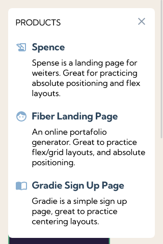
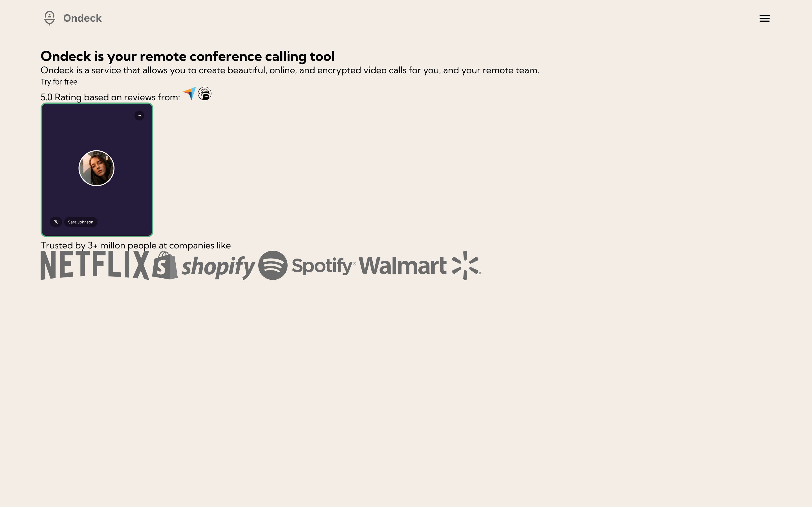

# Codewell challenge (Javascript30 Navbar)

## Resumen del desafio
[Este desafio](https://www.codewell.cc/challenges/javascript30-navbar--623f19001fa95910c7bf998e "Ir al desafio") consta de crear una apgina basica donde se busca enfocar el comportamiento del navbar, y a su vez que sea  responsive.

## **Desarrollo actual:**

Mobile (NavBar display: none) :
---

Mobile (NavBar active) :
---

Desktop :
---
